# AEC File Sync Platform – Solution Architecture

**Feature**: 001-aec-file-sync | **Date**: 2025-10-25  
**Purpose**: Multi-tenant SaaS file synchronization between Autodesk Construction Cloud and Microsoft SharePoint Online

---

## 1. High-Level System Architecture

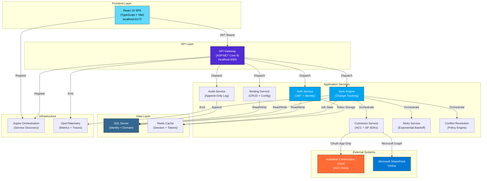

---

## 2. Frontend Architecture

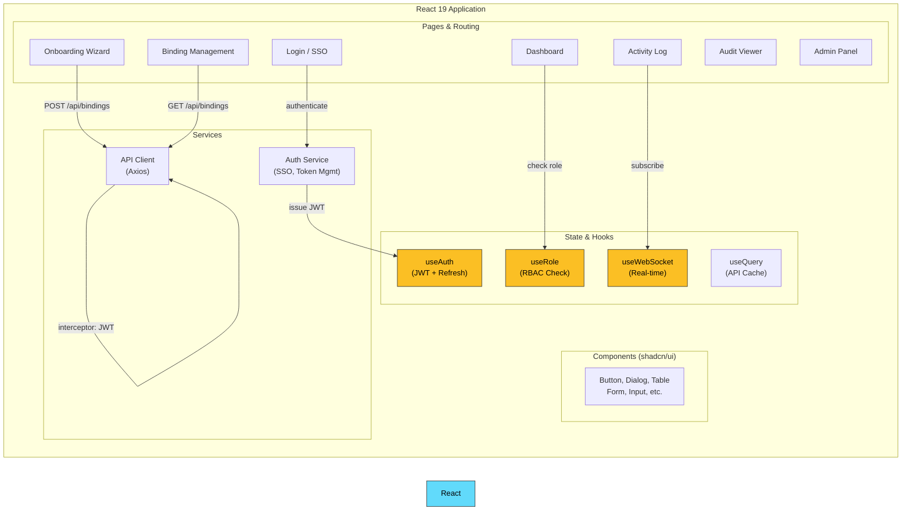

---

## 3. Backend Layered Architecture

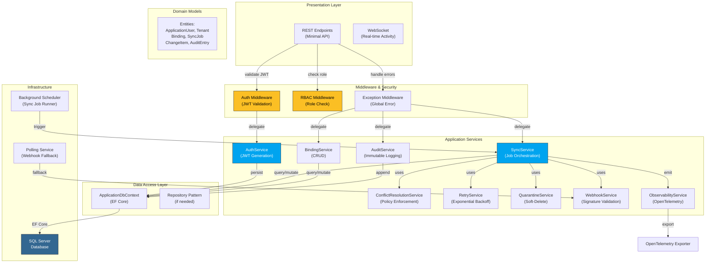

---

## 4. Data Model Architecture

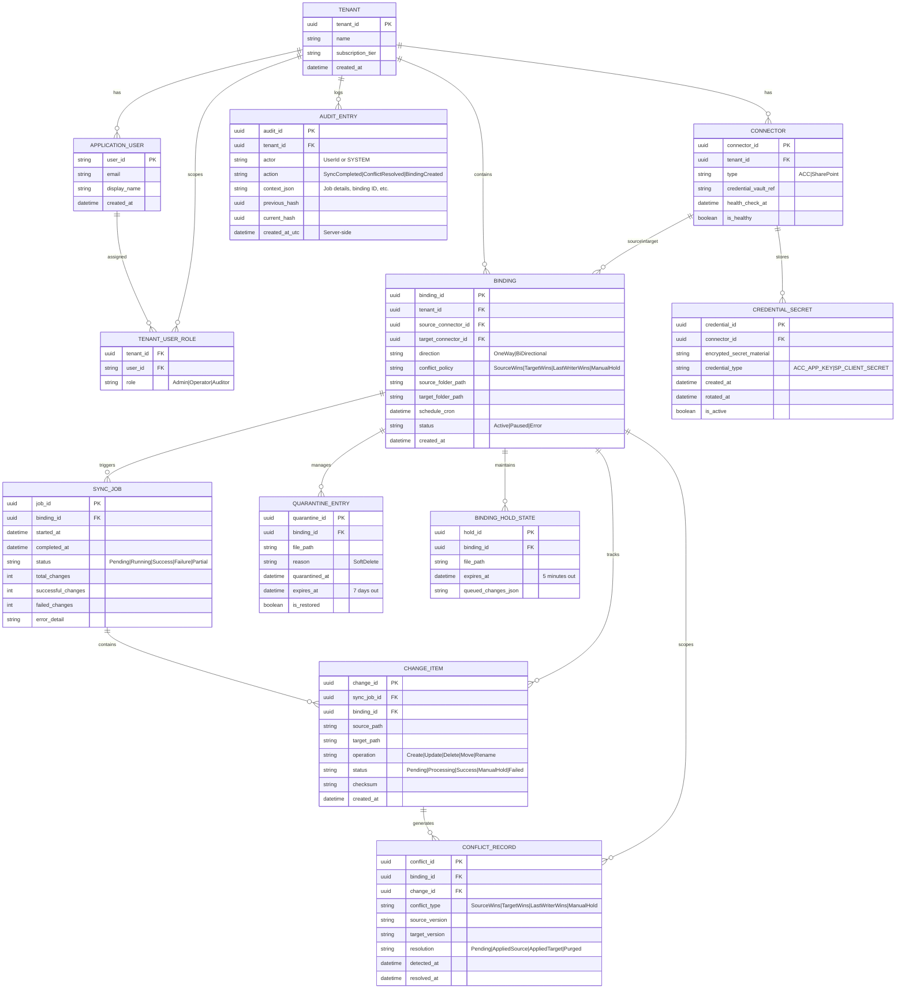

---

## 5. Authentication & Authorization Flow

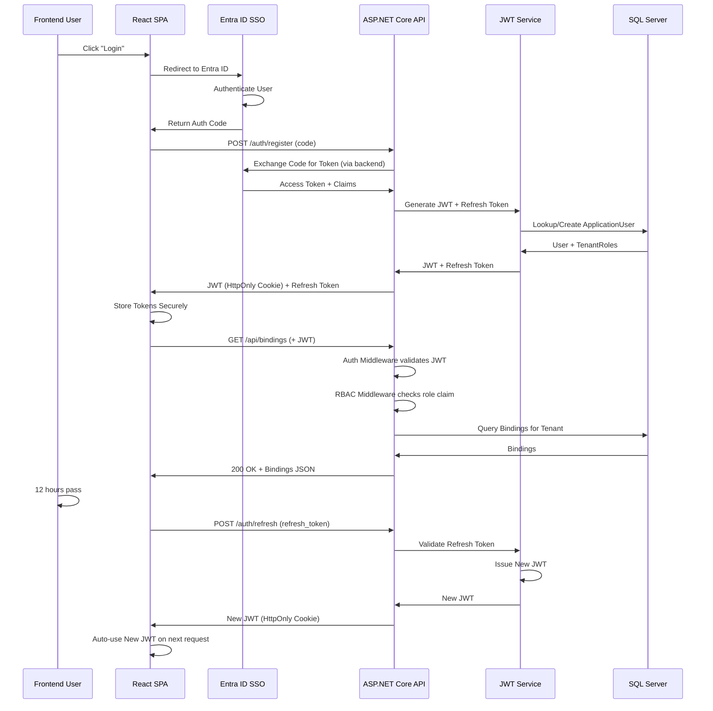

---

## 6. Sync Job Orchestration & Conflict Resolution

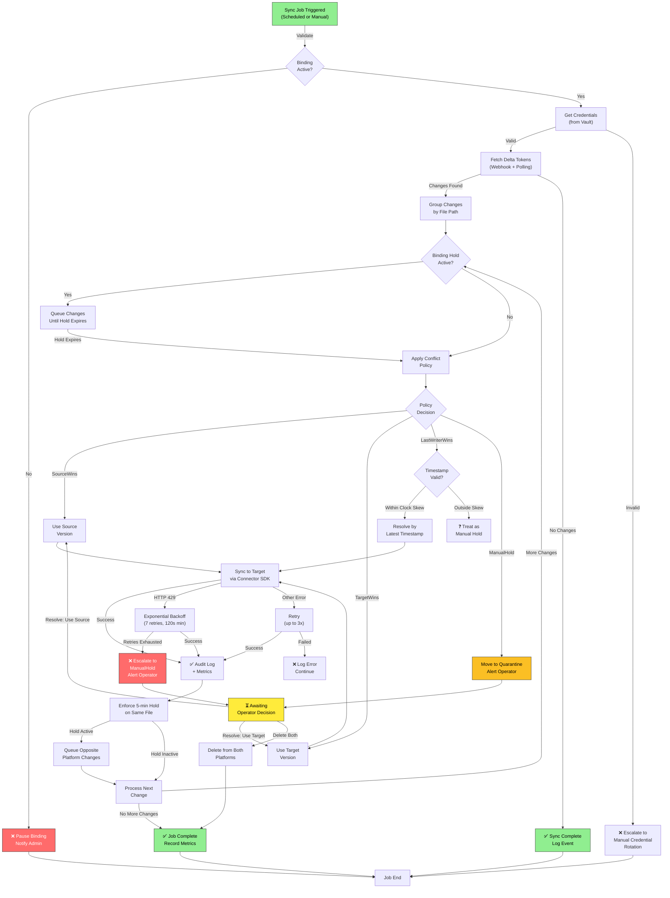

---

## 7. Audit Trail & Compliance

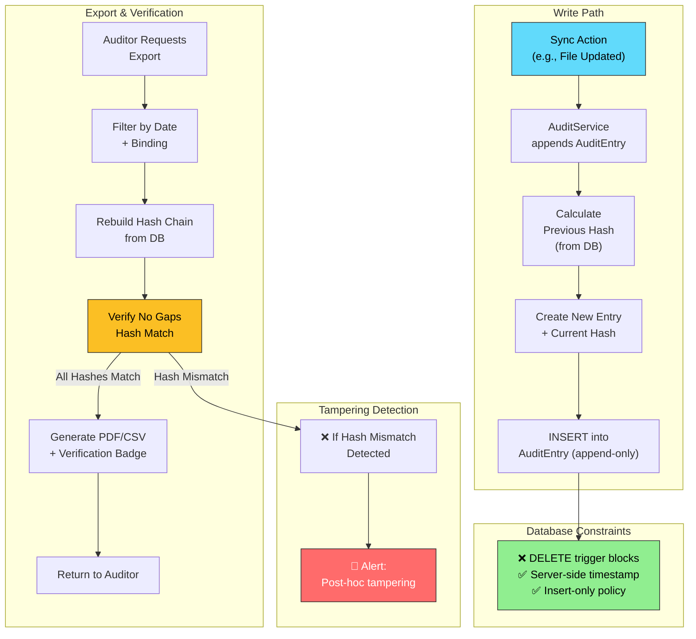

---

## 8. Deployment Architecture (Multi-Tenant SaaS)

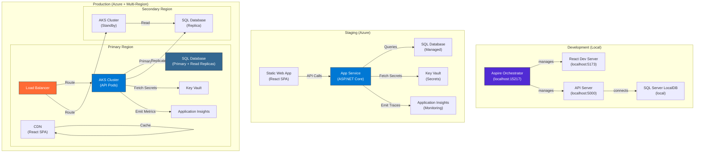

---

## 9. API Gateway & Endpoint Structure

```mermaid
graph TB
    Gateway["API Gateway<br/>(ASP.NET Core Minimal API)<br/>Base: /api/v1"]

    subgraph "Auth Endpoints"
        EP1["POST /auth/register<br/>(Entra ID + create user)"]
        EP2["POST /auth/login<br/>(JWT issue)"]
        EP3["POST /auth/refresh<br/>(Refresh token)"]
        EP4["POST /auth/logout<br/>(Revoke)"]
    end

    subgraph "Binding Endpoints"
        EP5["GET /bindings<br/>(List user's bindings)"]
        EP6["POST /bindings<br/>(Create binding)"]
        EP7["GET /bindings/{id}<br/>(View binding)"]
        EP8["PUT /bindings/{id}<br/>(Update config)"]
        EP9["DELETE /bindings/{id}<br/>(Soft-delete)"]
        EP10["POST /bindings/{id}/sync/trigger<br/>(Manual sync)"]
        EP11["POST /bindings/{id}/pause<br/>(Pause binding)"]
    end

    subgraph "Sync Job Endpoints"
        EP12["GET /sync/jobs<br/>(List jobs)"]
        EP13["GET /sync/jobs/{jobId}<br/>(Job status)"]
        EP14["GET /sync/jobs/{jobId}/changes<br/>(Changes detail)"]
    end

    subgraph "Activity Log Endpoints"
        EP15["GET /activity<br/>(Activity history)"]
        EP16["WS /ws/activity/stream<br/>(Real-time)"]
    end

    subgraph "Conflict Resolution Endpoints"
        EP17["GET /conflicts/quarantine<br/>(List quarantined)"]
        EP18["POST /conflicts/{conflictId}/resolve<br/>(Choose source/target)"]
    end

    subgraph "Audit Endpoints"
        EP19["GET /audit<br/>(Search audit trail)"]
        EP20["POST /audit/export<br/>(Export with hash verify)"]
    end

    subgraph "Admin Endpoints"
        EP21["GET /tenants/{tenantId}/users<br/>(List users)"]
        EP22["POST /tenants/{tenantId}/users/{userId}/roles<br/>(Assign role)"]
        EP23["POST /connectors/credentials/rotate<br/>(Rotate creds)"]
    end

    Gateway -->|Auth| EP1
    Gateway -->|Auth| EP2
    Gateway -->|Auth| EP3
    Gateway -->|Auth| EP4

    Gateway -->|Binding| EP5
    Gateway -->|Binding| EP6
    Gateway -->|Binding| EP7
    Gateway -->|Binding| EP8
    Gateway -->|Binding| EP9
    Gateway -->|Binding| EP10
    Gateway -->|Binding| EP11

    Gateway -->|Sync| EP12
    Gateway -->|Sync| EP13
    Gateway -->|Sync| EP14

    Gateway -->|Activity| EP15
    Gateway -->|Activity| EP16

    Gateway -->|Conflict| EP17
    Gateway -->|Conflict| EP18

    Gateway -->|Audit| EP19
    Gateway -->|Audit| EP20

    Gateway -->|Admin| EP21
    Gateway -->|Admin| EP22
    Gateway -->|Admin| EP23

    style Gateway fill:#512bd4,stroke:#333,color:#fff
    style EP1 fill:#00a4ef,stroke:#333,color:#fff
    style EP2 fill:#00a4ef,stroke:#333,color:#fff
    style EP10 fill:#fbbf24,stroke:#333,color:#000
    style EP16 fill:#90ee90,stroke:#333,color:#000
    style EP18 fill:#ff6b6b,stroke:#333,color:#fff
```

---

## 10. Security Architecture

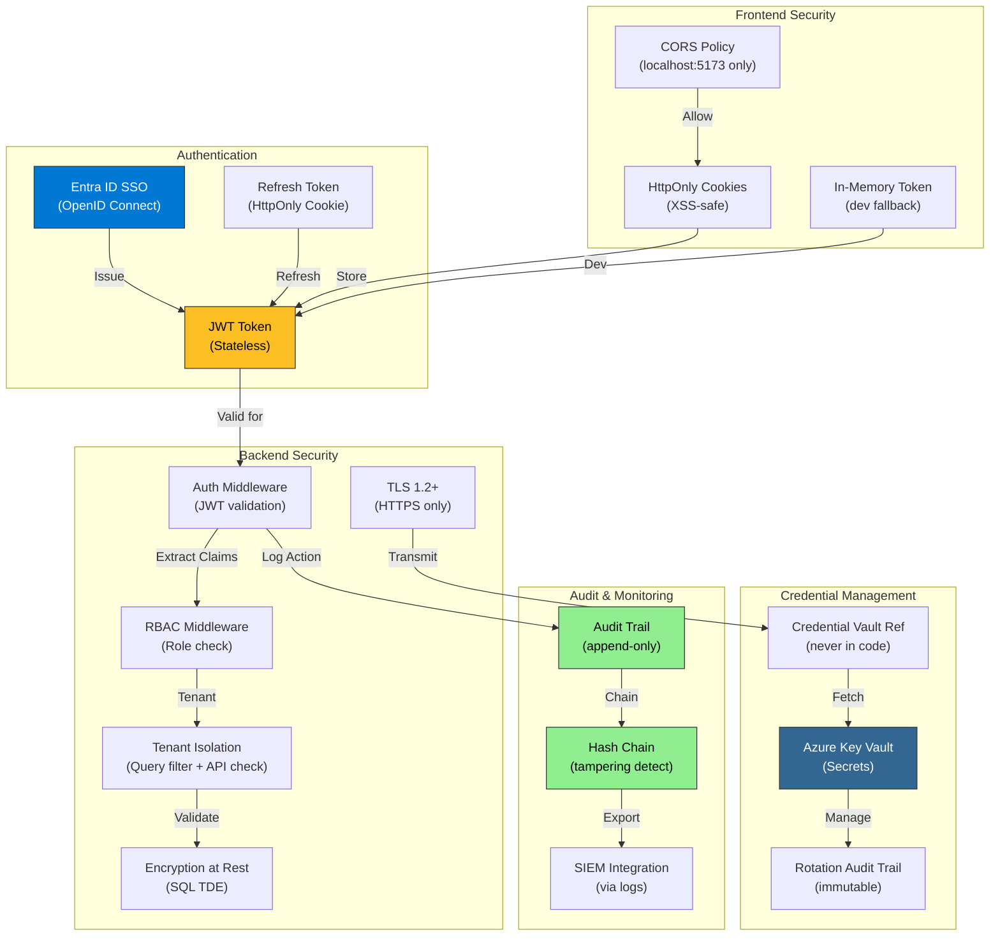

---

## 11. Observability & Monitoring

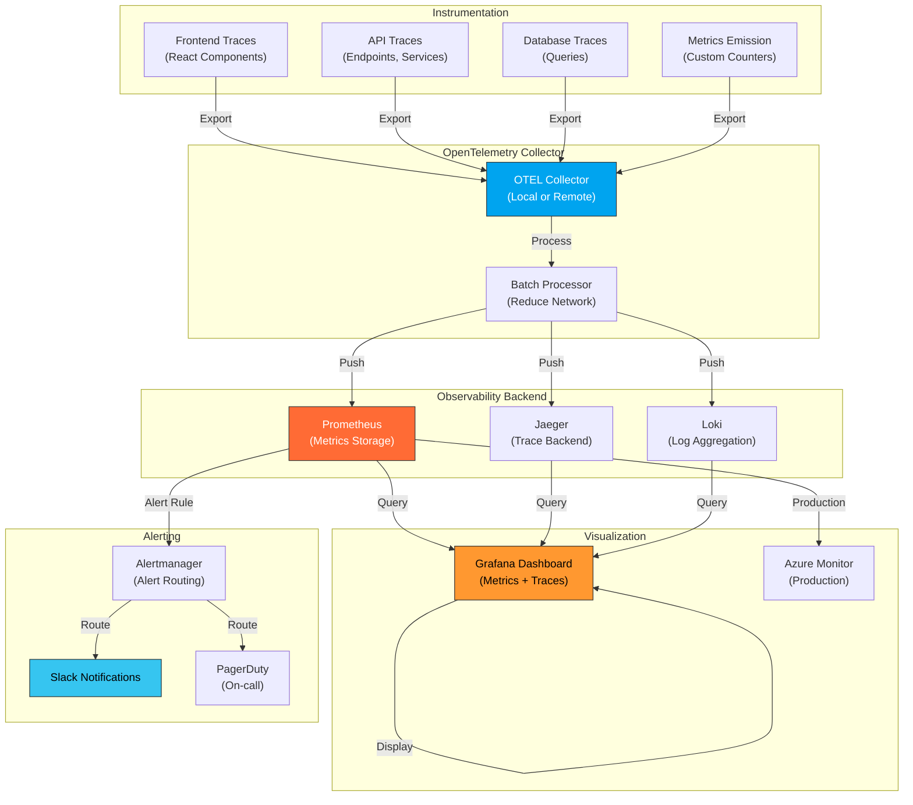

---

## 12. Connector Integration Pattern

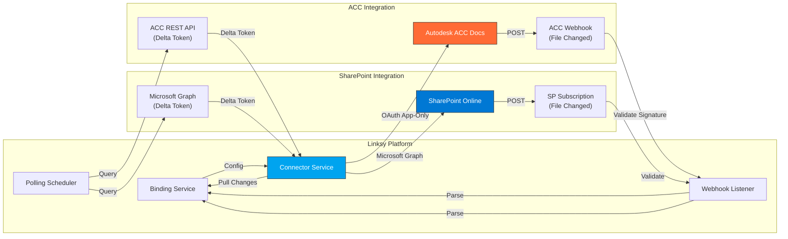

---

## Architecture Decision Records (ADRs)

| Decision | Rationale | Trade-offs |
|----------|-----------|-----------|
| **Minimal API Pattern** | Lightweight, modern endpoint definition; excellent for microservices | Less middleware flexibility than full ASP.NET Core; requires manual dependency injection |
| **JWT + HttpOnly Cookies** | XSS-safe token storage; OWASP recommended for SPAs | Slightly more complex than localStorage; requires CSRF tokens for mutations |
| **Tenant-Scoped RBAC** | Multi-tenant isolation enforced at API + DB layer | Requires tenant context on every request; query filtering adds complexity |
| **Append-Only Audit Trail** | Compliance requirement for immutability; hash chain detects tampering | Append-only grows unbounded; must implement retention/archival |
| **Webhook + Polling Fallback** | Resilient to provider outages; delta polling detects missed webhooks | Dual strategy increases complexity; polling adds latency |
| **5-Minute Binding Hold** | Prevents sync oscillation; UX-reasonable operator response time | May cause temporary stale state; requires state management complexity |
| **Exponential Backoff (7 retries, 120s)** | Respects service rate limits; spans 2+ rate-limit windows | May fail if limits are <120s; requires tuning per connector |
| **Soft-Delete Quarantine (7 days)** | Operator recovery window; automatic purge prevents indefinite storage | Complicates storage model; requires background purge job |

---

## Technology Stack Summary

| Layer | Technology | Version | Purpose |
|-------|-----------|---------|---------|
| **Frontend** | React | 19.0+ | UI framework (TypeScript only) |
| **Frontend Build** | Vite | 5.0+ | Modern bundler w/ HMR |
| **Frontend Styling** | Tailwind CSS | 4.0+ | Utility-first CSS |
| **Frontend Components** | shadcn/ui | Latest | Radix primitives + Tailwind |
| **Backend** | ASP.NET Core | 9.0 | REST API (Minimal API pattern) |
| **Backend Auth** | Identity + JWT | .NET 9.0 | Stateless token-based auth |
| **Backend ORM** | EF Core | 9.0 | SQL Server data access |
| **Database** | SQL Server | 2019+ | Multi-tenant data store |
| **Logging** | ILogger + Serilog | Latest | Structured logs → Aspire/SIEM |
| **Metrics** | OpenTelemetry | 1.13+ | Prometheus-compatible export |
| **Orchestration** | Aspire | 9.5.1 | Service discovery + health checks |
| **Testing** | xUnit + Moq | Latest | Backend unit + integration tests |
| **Testing** | Vitest + RTL | Latest | Frontend component + service tests |

---

## Summary

This architecture delivers a **secure, scalable, multi-tenant SaaS platform** for AEC file synchronization:

- ✅ **Frontend**: React 19 SPA with JWT + RBAC enforcement
- ✅ **Backend**: Layered ASP.NET Core services with clear separation of concerns
- ✅ **Data**: Append-only audit trail, soft-delete quarantine, tenant isolation
- ✅ **Connectors**: Webhook-first with polling fallback for resilience
- ✅ **Observability**: OpenTelemetry metrics, structured logs, real-time activity stream
- ✅ **Security**: HTTPS, TLS, encrypted credentials, RBAC, audit trail + hash chain
- ✅ **Deployment**: Local dev (Aspire), staging (Azure App Service), production (AKS + multi-region failover)

All decisions are documented with trade-offs and rationale for future maintainability and evolution.
