# Linksy System Architecture

**Feature**: 001-aec-file-sync  
**Date**: 2025-10-25  
**Status**: Design Phase  
**Audience**: Engineering team, stakeholders, compliance auditors

---

## Table of Contents

1. [Executive Summary](#executive-summary)
2. [System Context](#system-context)
3. [High-Level Architecture](#high-level-architecture)
4. [Platform & Hosting Strategy](#platform--hosting-strategy)
5. [Layered Architecture](#layered-architecture)
6. [Data Model & Schema](#data-model--schema)
7. [Job Orchestration Pattern](#job-orchestration-pattern)
8. [Security & Authentication](#security--authentication)
9. [Observability & Monitoring](#observability--monitoring)
10. [Connector Integration](#connector-integration)
11. [Deployment Architecture](#deployment-architecture)
12. [Technology Stack](#technology-stack)
13. [Architecture Decision Records](#architecture-decision-records)

---

## Executive Summary

**Linksy** is a multi-tenant, serverless SaaS platform for bidirectional file synchronization between Autodesk Construction Cloud (ACC) Docs and Microsoft SharePoint Online. The system operates as a deterministic, event-driven sync engine that:

- **Minimizes cost**: Azure serverless (Functions, Durable Functions, SQL Serverless) scale to near-zero idle cost
- **Ensures reliability**: 99.5% daily job success rate with automatic retries and manual hold queues
- **Guarantees compliance**: Append-only audit trail with hash chain verification, 24h transient cache, 7d soft-delete quarantine
- **Enables operators**: Real-time activity logging, conflict resolution portal, credential rotation, observable metrics per tenant

The platform targets **P1 Onboarding** (guided wizard + immediate sync), **P2 Operations** (job management + conflict resolution), and **P3 Compliance** (audit exports + hash validation).

---

## System Context

### Actors

- **Tenant Admin**: Configures connectors, creates bindings, assigns user roles, triggers credential rotation
- **Operator**: Monitors sync jobs, resolves manual-hold conflicts, restores quarantined files, views activity logs
- **Auditor**: Reviews audit trail, exports compliance reports, verifies immutability
- **System**: Runs scheduled syncs, processes webhooks, executes exponential backoff retries, enforces oscillation holds

### External Systems

- **Autodesk Construction Cloud (ACC) Docs**: OAuth app-only credentials; polling via delta tokens; webhook events with signature validation
- **Microsoft SharePoint Online**: Microsoft Graph; app-only permissions; polling via delta tokens; subscription webhooks
- **Entra ID**: SSO via OpenID Connect; identity provider for tenant admins
- **Azure Key Vault**: Encrypted credential storage per tenant; rotation audit trail

### Success Criteria

| Criterion | Target | Rationale |
|-----------|--------|-----------|
| **SC-001** | 90% of admins complete onboarding in <10 min | Usability gate; establishes product-market fit |
| **SC-002** | 99.5% daily job success rate | Operational reliability baseline |
| **SC-003** | 95% of changes propagate within 10 min | User experience; demonstrates real-time feel |
| **SC-004** | ≥4/5 satisfaction score (pilot) | Customer confidence |
| **SC-005** | Zero persisted file content in exports | Compliance requirement |

---

## High-Level Architecture

### System Boundaries Diagram

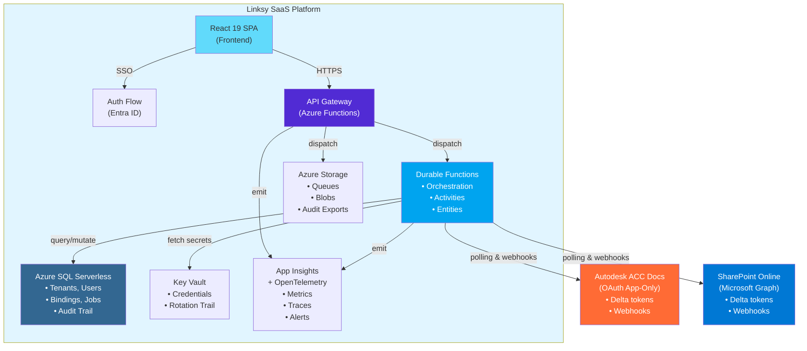

### Data Flow: Sync Job Execution

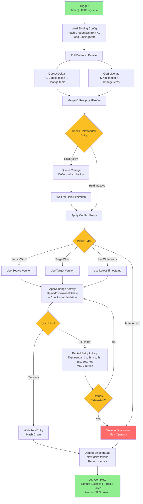

---

## Platform & Hosting Strategy

### Technology Stack by Layer

| Layer | Technology | Rationale | Notes |
|-------|-----------|-----------|-------|
| **Frontend** | Azure Static Web Apps + React 19 SPA | Global CDN, near-zero idle cost, built-in auth integrations | TypeScript strict mode, Vite, Tailwind CSS 4, shadcn/ui |
| **API Layer** | Azure Functions (HTTP-triggered, isolated .NET 9) | Pay-per-execution, auto-scale, minimal idle cost | Minimal API pattern, <200ms p95 latency target |
| **Job Orchestration** | Durable Functions (.NET 9) | Reliable state management, built-in retry logic, activity pattern | Orchestrators + Activities + Durable Entities for holds |
| **Identity** | Entra ID (B2E SSO) + ASP.NET Core Identity | Single sign-on, JWT issuance, RBAC claims | 12h JWT + refresh tokens, HttpOnly cookies |
| **Primary Store** | Azure SQL Database (Serverless tier) | Auto-pause idle, ACID transactions, RBAC via DB roles | Append-only audit constraints, tenant isolation via queries |
| **Messaging** | Azure Storage Queues (MVP) | Lowest cost option, poison queue support, visibility timeouts | Upgrade to Service Bus sessions if ordering critical |
| **Secrets** | Azure Key Vault | Encrypted credential storage, rotation audit trail, RBAC | Per-tenant credential isolation |
| **File Storage** | Azure Blob Storage with lifecycle policies | 24h transient cache auto-delete, 7d quarantine auto-delete, WORM audit exports | Compliance-grade immutability |
| **Observability** | Application Insights + OpenTelemetry 1.13.0 | Per-tenant metrics, distributed traces, alerting | Correlation IDs across API → Durable Functions |
| **Infrastructure** | Bicep or Terraform (IaC) | Parameterized templates for Dev/Staging/Prod | Single source of truth, repeatable deployments |

### Cost Model

- **Idle state**: Near-zero cost (SQL Serverless pauses, Functions scale to zero, Storage minimal)
- **Active state**: Pay per execution (Functions) + per-transaction (SQL) + per-job (Durable Functions)
- **Storage**: Transient cache (24h auto-delete) + Audit exports (WORM, versioned)
- **Observability**: App Insights Basic tier + OpenTelemetry export

---

## Layered Architecture

### Presentation Layer (Frontend)

```
React 19 SPA (TypeScript, strict mode)
├── Pages
│   ├── Login/SSO (Entra ID redirect)
│   ├── Dashboard (job overview, metrics)
│   ├── OnboardingWizard (connector validation, binding setup)
│   ├── BindingManager (CRUD, schedule, conflict policy)
│   ├── ActivityLog (job history, real-time WebSocket stream)
│   ├── ConflictResolver (quarantine view, one-click restore)
│   └── AuditExporter (filter, download, hash verification)
│
├── Components (shadcn/ui + Tailwind CSS 4)
│   ├── Button, Dialog, Form, Input, Table, etc.
│   ├── ConnectorAuthFlow (OAuth redirect handlers)
│   └── JobStatusIndicator (real-time status badges)
│
├── Hooks
│   ├── useAuth (JWT + refresh token lifecycle)
│   ├── useRole (RBAC check: Admin | Operator | Auditor)
│   ├── useWebSocket (Activity stream subscription)
│   └── useQuery (API cache / stale-while-revalidate)
│
├── Services
│   ├── api.ts (Axios client + JWT interceptor)
│   ├── auth.ts (SSO flow, token storage)
│   ├── telemetry.ts (OpenTelemetry client instrumentation)
│   └── audit.ts (export + hash chain verification)
│
└── Types (TypeScript interfaces)
    ├── Binding, Job, ChangeItem, AuditEntry
    └── Enums: ConflictPolicy, JobStatus, Role
```

### API Layer (Control Plane)

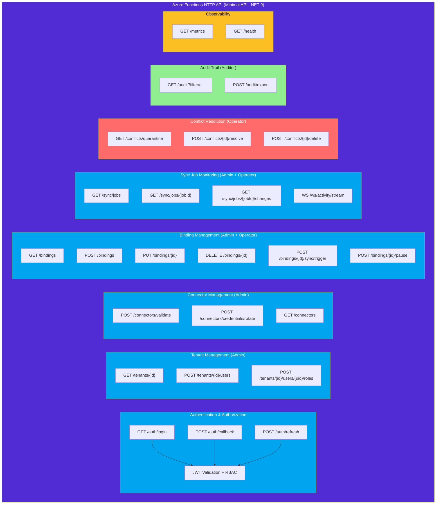

### Service Layer (Business Logic)

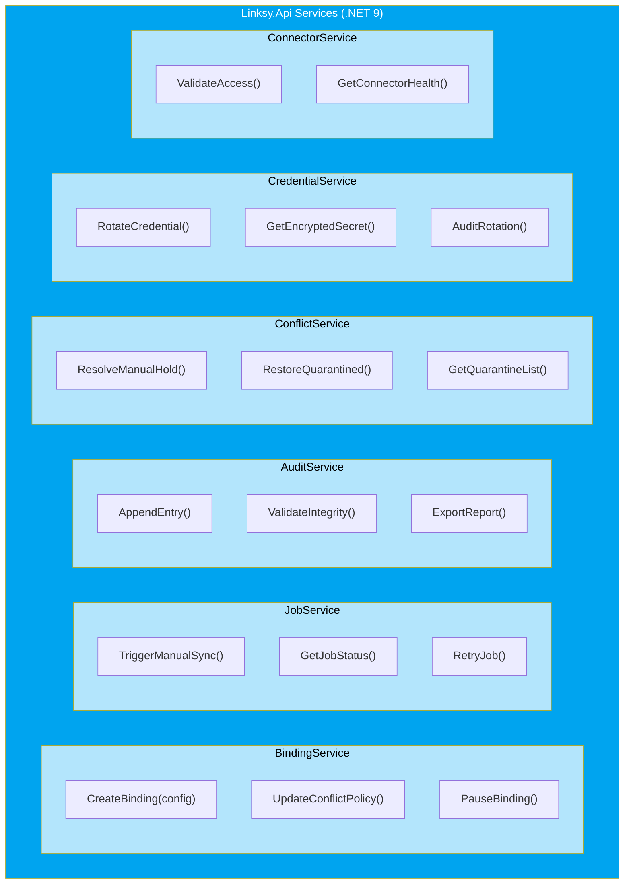

### Orchestration Layer (Durable Functions)

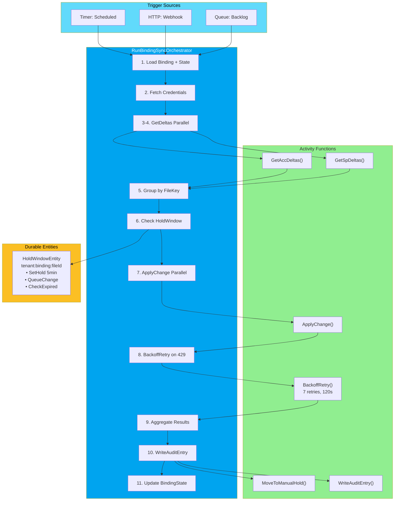

### Data Access Layer (EF Core)

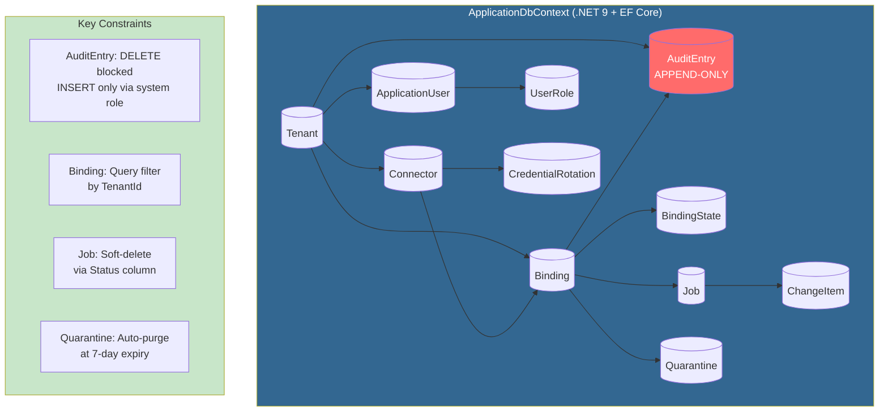

---

## Data Model & Schema

### Core Entities

```sql
-- Multi-tenancy root
CREATE TABLE Tenants (
    TenantId UNIQUEIDENTIFIER PRIMARY KEY,
    Name NVARCHAR(255) NOT NULL,
    BillingProfile NVARCHAR(MAX),  -- JSON
    Status NVARCHAR(50),             -- Active | Suspended
    CreatedAt DATETIME2 DEFAULT GETUTCDATE()
);

-- ASP.NET Core Identity users
CREATE TABLE ApplicationUsers (
    UserId NVARCHAR(450) PRIMARY KEY,
    TenantId UNIQUEIDENTIFIER NOT NULL FOREIGN KEY REFERENCES Tenants(TenantId),
    Email NVARCHAR(256) UNIQUE NOT NULL,
    DisplayName NVARCHAR(256),
    EntraObjectId UNIQUEIDENTIFIER,  -- Entra ID link
    CreatedAt DATETIME2 DEFAULT GETUTCDATE(),
    UNIQUE (TenantId, Email)
);

-- Tenant-scoped RBAC
CREATE TABLE UserRoles (
    UserId NVARCHAR(450) NOT NULL,
    TenantId UNIQUEIDENTIFIER NOT NULL,
    Role NVARCHAR(50) NOT NULL,      -- Admin | Operator | Auditor
    PRIMARY KEY (UserId, TenantId, Role),
    FOREIGN KEY (UserId) REFERENCES ApplicationUsers(UserId),
    FOREIGN KEY (TenantId) REFERENCES Tenants(TenantId)
);

-- External platform integrations
CREATE TABLE Connectors (
    ConnectorId UNIQUEIDENTIFIER PRIMARY KEY,
    TenantId UNIQUEIDENTIFIER NOT NULL FOREIGN KEY REFERENCES Tenants(TenantId),
    Kind NVARCHAR(50) NOT NULL,      -- ACC | SharePoint
    KeyVaultRef NVARCHAR(512),       -- Key Vault secret URI
    Health NVARCHAR(50),              -- Healthy | Warning | Error
    LastValidatedAt DATETIME2,
    CreatedAt DATETIME2 DEFAULT GETUTCDATE(),
    INDEX IX_Tenant (TenantId)
);

-- Binding configurations
CREATE TABLE Bindings (
    BindingId UNIQUEIDENTIFIER PRIMARY KEY,
    TenantId UNIQUEIDENTIFIER NOT NULL,
    AccConnectorId UNIQUEIDENTIFIER NOT NULL FOREIGN KEY REFERENCES Connectors(ConnectorId),
    SpConnectorId UNIQUEIDENTIFIER NOT NULL FOREIGN KEY REFERENCES Connectors(ConnectorId),
    AccPath NVARCHAR(512) NOT NULL,
    SpPath NVARCHAR(512) NOT NULL,
    Direction NVARCHAR(50) NOT NULL,  -- OneWay | BiDirectional
    ConflictPolicy NVARCHAR(50),      -- SourceWins | TargetWins | LastWriterWins | ManualHold
    Schedule NVARCHAR(100),           -- Cron expression
    Status NVARCHAR(50) DEFAULT 'Active',  -- Active | Paused | Error
    CreatedAt DATETIME2 DEFAULT GETUTCDATE(),
    UpdatedAt DATETIME2 DEFAULT GETUTCDATE(),
    FOREIGN KEY (TenantId) REFERENCES Tenants(TenantId),
    INDEX IX_Tenant_Status (TenantId, Status),
    INDEX IX_Schedule (Schedule)
);

-- Binding state (delta tokens)
CREATE TABLE BindingState (
    BindingId UNIQUEIDENTIFIER PRIMARY KEY,
    AccDeltaToken NVARCHAR(MAX),
    SpDeltaToken NVARCHAR(MAX),
    LastSyncAt DATETIME2,
    AccChecksum NVARCHAR(128),
    SpChecksum NVARCHAR(128),
    UpdatedAt DATETIME2 DEFAULT GETUTCDATE(),
    FOREIGN KEY (BindingId) REFERENCES Bindings(BindingId)
);

-- Sync job execution records
CREATE TABLE Jobs (
    JobId UNIQUEIDENTIFIER PRIMARY KEY,
    BindingId UNIQUEIDENTIFIER NOT NULL,
    Status NVARCHAR(50),              -- Pending | Running | Success | Failure | Partial
    StartedAt DATETIME2,
    EndedAt DATETIME2,
    StatsJson NVARCHAR(MAX),          -- {files, bytes, errors}
    TriggeredBy NVARCHAR(450),        -- UserId or NULL (system)
    CreatedAt DATETIME2 DEFAULT GETUTCDATE(),
    FOREIGN KEY (BindingId) REFERENCES Bindings(BindingId),
    INDEX IX_BindingId_Status (BindingId, Status),
    INDEX IX_Status_CreatedAt (Status, CreatedAt)
);

-- Individual file changes
CREATE TABLE ChangeItems (
    ChangeId UNIQUEIDENTIFIER PRIMARY KEY,
    JobId UNIQUEIDENTIFIER NOT NULL,
    FileKey NVARCHAR(512) NOT NULL,
    Action NVARCHAR(50),              -- Create | Update | Delete | Move | Rename
    SourceVersion NVARCHAR(256),
    TargetVersion NVARCHAR(256),
    Retries INT DEFAULT 0,
    Status NVARCHAR(50),              -- Pending | Processing | Success | ManualHold | Failed
    DlqReason NVARCHAR(MAX),
    CreatedAt DATETIME2 DEFAULT GETUTCDATE(),
    FOREIGN KEY (JobId) REFERENCES Jobs(JobId),
    INDEX IX_JobId_Status (JobId, Status),
    INDEX IX_FileKey (FileKey)
);

-- Quarantine (soft-deleted + conflicted files)
CREATE TABLE Quarantine (
    QuarantineId UNIQUEIDENTIFIER PRIMARY KEY,
    BindingId UNIQUEIDENTIFIER NOT NULL,
    FileKey NVARCHAR(512) NOT NULL,
    Reason NVARCHAR(50),              -- Conflict | SoftDelete
    CreatedAt DATETIME2 DEFAULT GETUTCDATE(),
    ExpiresAt DATETIME2,              -- 7 days out
    VersionRefs NVARCHAR(MAX),        -- JSON: {accVersion, spVersion}
    RestoredAt DATETIME2,             -- NULL until restored
    FOREIGN KEY (BindingId) REFERENCES Bindings(BindingId),
    INDEX IX_BindingId_ExpiresAt (BindingId, ExpiresAt)
);

-- Append-only audit trail (IMMUTABLE)
CREATE TABLE AuditEntries (
    AuditId UNIQUEIDENTIFIER PRIMARY KEY,
    TenantId UNIQUEIDENTIFIER NOT NULL,
    BindingId UNIQUEIDENTIFIER,
    At DATETIME2 DEFAULT GETUTCDATE(),  -- Server-side timestamp
    Actor NVARCHAR(450),                -- UserId or NULL (system)
    Action NVARCHAR(256),               -- SyncCompleted | ConflictResolved | BindingCreated
    DetailsJson NVARCHAR(MAX),
    PrevHash NVARCHAR(64),              -- SHA256 of previous entry
    Hash NVARCHAR(64),                  -- SHA256 of this entry
    CreatedAt DATETIME2 DEFAULT GETUTCDATE(),
    FOREIGN KEY (TenantId) REFERENCES Tenants(TenantId),
    INDEX IX_TenantId_At (TenantId, At),
    INDEX IX_BindingId_At (BindingId, At),
    -- Constraints: DELETE/UPDATE blocked by trigger or RBAC
    CHECK (At IS NOT NULL)
);

-- Credential rotation history
CREATE TABLE CredentialRotation (
    RotationId UNIQUEIDENTIFIER PRIMARY KEY,
    ConnectorId UNIQUEIDENTIFIER NOT NULL,
    TriggeredBy NVARCHAR(450),          -- UserId
    TriggeredAt DATETIME2 DEFAULT GETUTCDATE(),
    ValidatedAt DATETIME2,
    Status NVARCHAR(50),                -- Pending | Success | Failed
    ErrorMessage NVARCHAR(MAX),
    FOREIGN KEY (ConnectorId) REFERENCES Connectors(ConnectorId),
    INDEX IX_ConnectorId_Status (ConnectorId, Status)
);
```

### Entity Relationships

```
Tenant (1) ──→ (many) ApplicationUser
         ──→ (many) Connector
         ──→ (many) Binding
         ──→ (many) AuditEntry

ApplicationUser (1) ──→ (many) UserRole
                  ──→ (many) Job (TriggeredBy)

Connector (1) ──→ (many) Binding (as AccConnector or SpConnector)
          ──→ (many) CredentialRotation

Binding (1) ──→ (1) BindingState
        ──→ (many) Job
        ──→ (many) ChangeItem
        ──→ (many) Quarantine
        ──→ (many) AuditEntry

Job (1) ──→ (many) ChangeItem
    ──→ (many) AuditEntry
```

---

## Job Orchestration Pattern

### Durable Functions Workflow

The core sync process uses **Orchestrator-Activity pattern** with **Durable Entities** for state management:

```
┌─ Trigger (Timer | HTTP | Queue)
│
├─ RunBindingSyncOrchestrator
│  │
│  ├─ Load Binding from SQL (tenant isolation)
│  ├─ Fetch Credentials from Key Vault
│  │
│  ├─ Parallel Activities:
│  │  ├─ GetAccDeltas (Poll ACC API with delta token)
│  │  └─ GetSpDeltas (Poll SP API with delta token)
│  │
│  ├─ Merge ChangeItems, Group by FileKey
│  │
│  └─ For each file, check HoldWindowEntity(tenant:binding:fileId)
│     │
│     ├─ If Hold Expired: Proceed to conflict resolution
│     │
│     └─ If Hold Active: Queue change, defer processing
│        │
│        ├─ Apply ConflictPolicy
│        │  ├─ SourceWins: Use ACC version
│        │  ├─ TargetWins: Use SP version
│        │  ├─ LastWriterWins: Compare timestamps (with clock skew guard)
│        │  └─ ManualHold: Move to quarantine, alert operator
│        │
│        └─ ApplyChange Activity
│           ├─ Attempt upload/download with checksum validation
│           ├─ On success: WriteAuditEntry
│           ├─ On HTTP 429: BackoffRetry activity
│           │  └─ Exponential backoff: 1s, 2s, 4s, 8s, 16s, 30s, 40s
│           │     Max 7 retries over 120s window
│           │     If exhausted: MoveToManualHold + alert operator
│           └─ On other error: Retry 3x, then log failure
│
├─ Aggregate results (files processed, bytes, conflicts, retries)
├─ Update BindingState with new delta tokens
├─ Emit metrics to App Insights (per tenant)
└─ Return Job status (Success | Partial | Failed)
```

### Oscillation Prevention

The **5-minute binding hold** prevents sync loops during rapid changes:

```
File X is modified on ACC
├─ Sync runs: ACC version wins (or policy decides)
├─ SP is updated
├─ SetHold(tenant:binding:X, 5 min)
│
└─ Within 5 minutes, SP triggers webhook: "File X modified"
   ├─ New change queued by HoldWindowEntity
   ├─ Hold still active
   └─ Change deferred until hold expires
      │
      └─ After 5 min, hold releases
         └─ Change processed (if sync runs again)
```

**Alternative design**: Use **Durable Entities with state management** to queue changes during hold window, auto-releasing when hold expires.

---

## Security & Authentication

### Authentication Flow

```
User (Tenant Admin)
│
├─ (1) Click "Login"
│
├─ (2) React redirects to GET /auth/login
│  └─ Azure Function initiates Entra ID OpenID Connect flow
│
├─ (3) Entra ID login page
│  └─ User authenticates with org credentials
│
├─ (4) Entra ID callback → Azure Function
│  │   (POST /auth/callback with auth code)
│  │
│  ├─ Exchange code for access token (Entra ID)
│  ├─ Lookup/create ApplicationUser in SQL
│  ├─ Query UserRoles for tenant + roles
│  ├─ Issue JWT (12h expiry) with claims: {sub, email, roles, tenant_id}
│  ├─ Issue refresh token (HttpOnly cookie, 7d expiry)
│  └─ Redirect to React app with tokens
│
├─ (5) React stores JWT (in-memory or secure storage)
│  └─ Stores refresh token in HttpOnly cookie
│
└─ (6) Subsequent API requests
   └─ All requests include: Authorization: Bearer {JWT}
      └─ API middleware validates JWT signature + expiry
         └─ Extracts role claims for RBAC
            └─ If expired: POST /auth/refresh (uses HttpOnly cookie)
               └─ Issues new JWT, continues request
```

### Authorization Model

**Three-tier RBAC** scoped per tenant:

| Role | Permissions |
|------|------------|
| **Tenant Admin** | Create/edit/delete bindings, manage connectors, assign user roles, trigger credential rotation, view all activity |
| **Operator** | Trigger manual syncs, resolve ManualHold conflicts, restore quarantined files, view job status + activity logs, acknowledge alerts |
| **Auditor** | Read-only access to audit logs, filter by date/binding/actor, export compliance reports, verify hash chain |

**Enforcement**:
- API endpoints validate JWT claims: `req.HttpContext.User.IsInRole("Operator")`
- Database queries filtered by TenantId (tenant isolation)
- Audit entries record actor (UserId) for all mutations

### Credential Management

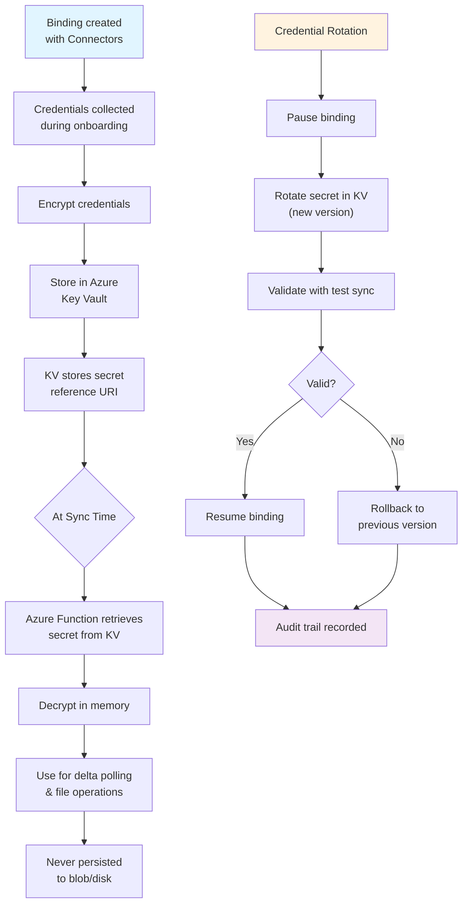

---

## Observability & Monitoring

### Metrics (Per Tenant)

Emitted to **Application Insights** via **OpenTelemetry 1.13.0**:

```
Counter: sync_jobs_total
├─ dimension: status (success | partial | failed)
├─ dimension: binding_id
└─ dimension: tenant_id

Gauge: sync_job_duration_seconds
├─ dimension: binding_id
└─ dimension: conflict_policy

Counter: files_synced_total
├─ dimension: action (create | update | delete | move | rename)
├─ dimension: binding_id
└─ dimension: direction (acc_to_sp | sp_to_acc)

Counter: conflicts_detected_total
├─ dimension: policy (manual_hold | source_wins | target_wins | last_writer_wins)
└─ dimension: binding_id

Counter: retries_total
├─ dimension: reason (http_429 | timeout | transient_error)
└─ dimension: retry_attempt

Gauge: http_429_throttle_events
├─ dimension: connector (acc | sp)
├─ dimension: binding_id
└─ dimension: retry_window_seconds

Gauge: quarantine_files_count
├─ dimension: binding_id
├─ dimension: reason (soft_delete | conflict)
└─ dimension: days_in_quarantine
```

### Traces (Distributed)

OpenTelemetry correlation IDs span entire flow:

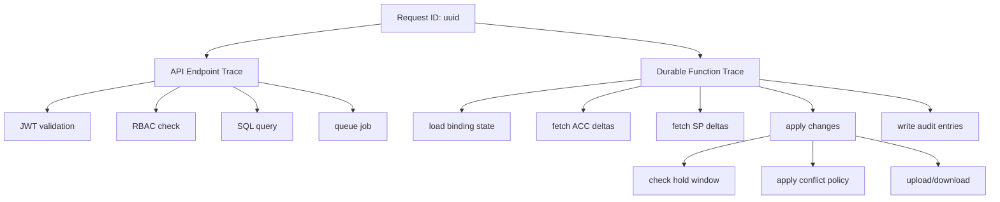

### Alerting

**Application Insights alert rules**:

| Alert | Condition | Action |
|-------|-----------|--------|
| **HTTP 429 Spike** | >10 throttle events in 5 min | Email ops, create incident |
| **Job Failure Rate** | <99.5% daily success | Page on-call engineer |
| **Audit Trail Gap** | Hash chain validation fails | Security team escalation |
| **Quarantine Overflow** | >1000 files in quarantine | Notify tenant admin |
| **Latency SLO Breach** | p95 latency >1s | Investigate resource scaling |

---

## Connector Integration

### Connector Interface

Both ACC Docs and SharePoint Online connectors implement **IConnector**:

```csharp
public interface IConnector
{
    Task<DeltaResponse> GetDeltasAsync(string deltaToken, CancellationToken ct);
    Task<UploadResult> UploadFileAsync(FileContent content, CancellationToken ct);
    Task<DownloadResult> DownloadFileAsync(string fileKey, CancellationToken ct);
    Task<DeleteResult> DeleteFileAsync(string fileKey, CancellationToken ct);
    Task ValidateAccessAsync(CancellationToken ct);
    Task<HealthStatus> GetHealthAsync(CancellationToken ct);
}
```

### ACC Connector

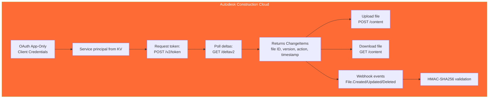

### SharePoint Connector

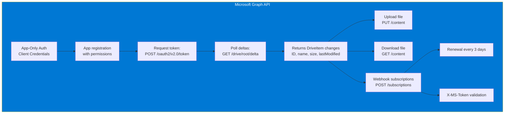

---

## Deployment Architecture

### Local Development (Aspire)

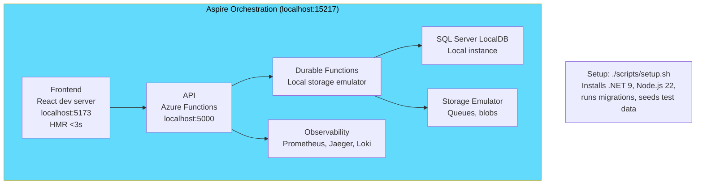

### Staging Environment (Azure)

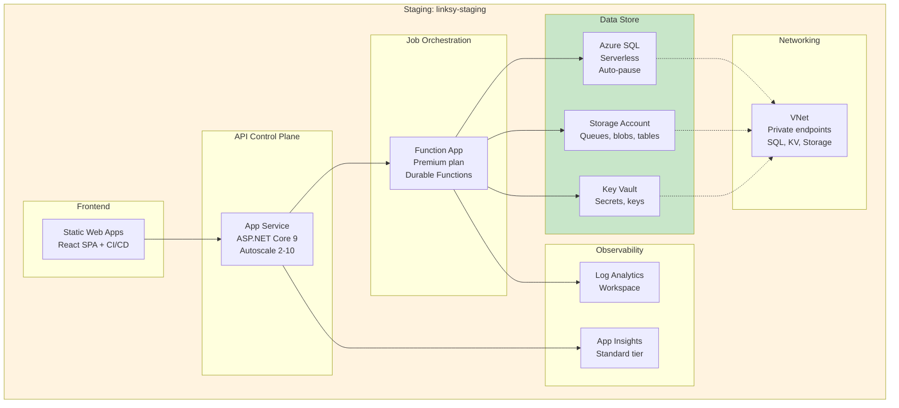

### Production Environment (Multi-Region)

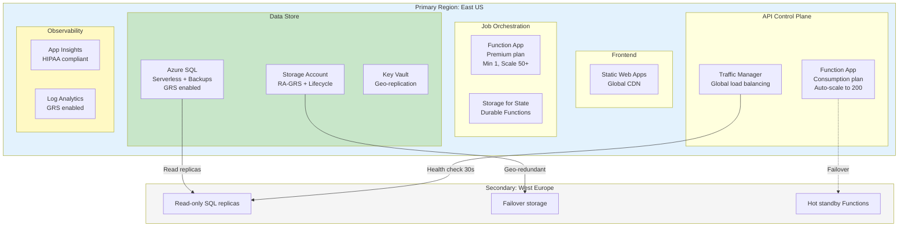

**Deployment**: Infrastructure as Code (Bicep or Terraform) with parameterized environment configs.

---

## Technology Stack

### Backend (.NET 9.0)

| Component | Version | Purpose |
|-----------|---------|---------|
| ASP.NET Core | 9.0 | Minimal API pattern, fast HTTP endpoints |
| Azure Functions | v4 | Serverless compute (HTTP triggers, Durable Functions) |
| Azure Durable Functions | 2.x | Orchestration, state management, activity pattern |
| Entity Framework Core | 9.0 | ORM, SQL migrations, tenant isolation queries |
| Azure Identity | 1.11+ | Managed identity, Key Vault access |
| Azure Storage | 12.x | Queues, blobs, table storage SDKs |
| Azure Service Bus | 7.x | Messaging (future upgrade from Queues) |
| OpenTelemetry | 1.13.0 | Distributed tracing, metrics export |
| xUnit | 2.9.3 | Unit testing framework |
| Moq | Latest | Mocking library for integration tests |

### Frontend (TypeScript 5.3+)

| Component | Version | Purpose |
|-----------|---------|---------|
| React | 19.0+ | UI framework (strict mode) |
| Vite | 5.0+ | Modern bundler, HMR <3s |
| TypeScript | 5.3+ | Type safety, strict mode enabled |
| Tailwind CSS | 4.0+ | Utility-first styling |
| shadcn/ui | Latest | Accessible component library (Radix + Tailwind) |
| Axios | Latest | HTTP client with JWT interceptors |
| React Router | Latest | SPA routing |
| Vitest | 1.0+ | Unit testing (frontend) |
| React Testing Library | 15.0+ | Component testing utilities |

### Infrastructure & Observability

| Component | Version | Purpose |
|-----------|---------|---------|
| Azure Functions Runtime | 4.0 | Serverless execution |
| Azure SQL Database | Any (Serverless) | Multi-tenant data store |
| Azure Storage Account | Standard | Queues, blobs, tables |
| Azure Key Vault | — | Credential encryption |
| Application Insights | Standard | Metrics, traces, alerting |
| Azure Static Web Apps | — | Frontend CDN + auth |
| Bicep or Terraform | Latest | Infrastructure as Code |

---

## Architecture Decision Records

### ADR-001: Serverless-First Architecture

**Decision**: Deploy on Azure Functions (Consumption plan) + Durable Functions instead of AKS or App Service.

**Rationale**:
- **Cost**: Pay-per-execution scales to near-zero idle; avoids container orchestration overhead
- **Simplicity**: No cluster management, no container ops
- **Compliance**: Stateless functions align with audit trail immutability

**Trade-offs**:
- Cold start latency (~1-2s first request); mitigated by Premium plan for production
- Durable Functions state persisted to Storage; eventual consistency model
- Max execution timeout 10 minutes; long-running jobs split into activities

**Alternatives Considered**:
- Azure Kubernetes Service (AKS): overkill for MVP, higher operational cost
- App Service: fixed cost, less elastic for bursty workloads

---

### ADR-002: Append-Only Audit Trail with Hash Chain

**Decision**: Store audit entries in append-only SQL table with database-level DELETE constraints and SHA256 hash chain.

**Rationale**:
- **Compliance**: Immutable log required for regulated AEC environments (SOC 2, HIPAA)
- **Tamper Detection**: Hash chain validation detects post-hoc modifications
- **Auditability**: Complete record of all sync decisions, actor, timestamp

**Trade-offs**:
- Append-only table grows unbounded; requires archival/retention policy
- Hash chain computation adds 1-2ms per entry; acceptable for compliance requirement
- Export performance scales with audit volume; pagination mitigates

**Alternatives Considered**:
- Event Sourcing in Event Store: external service, adds complexity
- Blob-only audit (WORM): no queryability, harder to export by date range

---

### ADR-003: Durable Entities for Oscillation Prevention

**Decision**: Use Durable Entities (state actors) to implement 5-minute binding holds per file, queuing opposite-platform changes during hold window.

**Rationale**:
- **Deterministic**: Prevents sync loops without central lock coordination
- **Scalable**: Entity per `(tenant:binding:fileId)` distributes state
- **Built-in**: Durable Functions native feature, no external state store

**Trade-offs**:
- Hold window is approximate (Durable Function execution may delay release)
- Queue of pending changes stored in entity; memory overhead for high-change workloads
- Manual testing of hold behavior requires Durable Functions emulator setup

**Alternatives Considered**:
- Redis-backed hold window: external dependency, adds latency
- BindingState table with hold timestamp: coarse-grained (binding-level, not per-file)

---

### ADR-004: Multi-Connector Interface (IConnector Pattern)

**Decision**: Abstract connector implementation behind `IConnector` interface for ACC and SharePoint, enabling future connectors (OneDrive, Google Drive, Box).

**Rationale**:
- **Extensibility**: New connectors pluggable without core changes
- **Testability**: Mock connectors for unit tests
- **Consistency**: Delta token handling, checksum validation, backoff retry unified

**Trade-offs**:
- Requires upfront interface design; delays MVP if design incomplete
- Connector SDKs vary (ACC REST, Microsoft Graph); adapter overhead
- Activity functions hard-coded for ACC/SP; generalization deferred to Phase 2

**Alternatives Considered**:
- Monolithic controller (if/else on connector type): tightly coupled
- Plugin architecture (DLL loading): complex, risky at runtime

---

### ADR-005: React 19 + TypeScript Strict Mode

**Decision**: Frontend built exclusively in TypeScript with `strict: true` in `tsconfig.json`. No JavaScript files allowed in `src/frontend/src/`.

**Rationale**:
- **Type Safety**: Catches runtime errors at compile time
- **Compliance with Linksy Guidelines**: Enforced by project constitution
- **Maintainability**: Clear interfaces, self-documenting code

**Trade-offs**:
- Slower initial development (verbose type definitions)
- Requires discipline to avoid `any` types
- Larger initial bundle (mitigated by tree-shaking, Vite optimization)

**Alternatives Considered**:
- Mixed TypeScript + JavaScript: inconsistent, error-prone
- JavaScript only: loses type safety, conflicts with project standards

---

### ADR-006: JWT + HttpOnly Cookies (Stateless Auth)

**Decision**: Stateless JWT authentication with 12-hour expiry and refresh tokens stored in HttpOnly cookies.

**Rationale**:
- **Stateless**: No backend session store required; scales horizontally
- **XSS Resilience**: HttpOnly cookies prevent JavaScript access
- **OWASP Recommended**: Current best practice for SPAs
- **Mobile-Friendly**: Tokens can be passed via Authorization header

**Trade-offs**:
- Refresh token rotation required for key rotation
- Session revocation not immediate (JWT valid until expiry); mitigated by token blacklist for logout
- Requires CSRF tokens for state-changing operations (POST, PUT, DELETE)

**Alternatives Considered**:
- Session-based (cookie): requires backend session store, harder to scale
- Implicit flow (localStorage): XSS vulnerability, deprecated by OAuth 2.0
- Passwordless (FIDO2): future enhancement, not MVP

---

### ADR-007: Azure Blob Storage Lifecycle Policies for Compliance

**Decision**: Three blob containers (transient-cache, quarantine, audit-exports) with lifecycle policies for auto-deletion (24h, 7d) and WORM+versioning on exports.

**Rationale**:
- **Compliance**: Automatic lifecycle reduces manual data retention overhead
- **Cost**: Removes stale transient cache, automatic purge of quarantine
- **Immutability**: WORM + versioning on audit exports detect tampering

**Trade-offs**:
- Lifecycle policies are eventual (run once per day); short-lived files may persist briefly
- WORM adds storage cost (versioning); acceptable for audit trail (low churn)
- No fine-grained access control per file; container-level ACLs only

**Alternatives Considered**:
- Custom TTL in application code: fragile, manual cleanup burden
- Azure Data Lake for archive: over-engineered for MVP

---

### ADR-008: Storage Queues (MVP) → Service Bus (Future)

**Decision**: Use Azure Storage Queues for MVP (cheapest option). Upgrade to Service Bus with sessions for strict FIFO if per-binding ordering becomes critical.

**Rationale**:
- **MVP**: Low cost, sufficient for MVP scale; poison queue + visibility timeout handle retries
- **Future-Proof**: Service Bus upgrade transparent to application logic (both are queue abstractions)

**Trade-offs**:
- Storage Queues have eventual consistency (seconds delay); acceptable for retry backlog
- No native message sessions; per-binding FIFO requires application coordination
- Visibility timeout max 7 days; long-held retries move to DLQ

**Alternatives Considered**:
- Event Grid: event-driven, not ideal for retry queues
- Azure Service Bus from day 1: higher cost, unnecessary for MVP

---

## Conclusion

This architecture delivers a **secure, scalable, compliance-grade multi-tenant SaaS platform** with:

✅ **Cost Efficiency**: Serverless scales to near-zero idle; pay-per-execution model aligns with unpredictable sync workloads.  
✅ **Deterministic Sync**: Durable Functions + delta tokens + oscillation prevention ensure no data loss or duplication.  
✅ **Audit Compliance**: Append-only trail + hash chain + WORM exports satisfy SOC 2, HIPAA, regulatory requirements.  
✅ **Operational Excellence**: OpenTelemetry observability, per-tenant metrics, alerting, manual-hold safety valves.  
✅ **Developer Experience**: Aspire local orchestration, TypeScript strict mode, React 19 modern UX, comprehensive testing.  

All decisions documented with trade-offs and rationale for future evolution.
